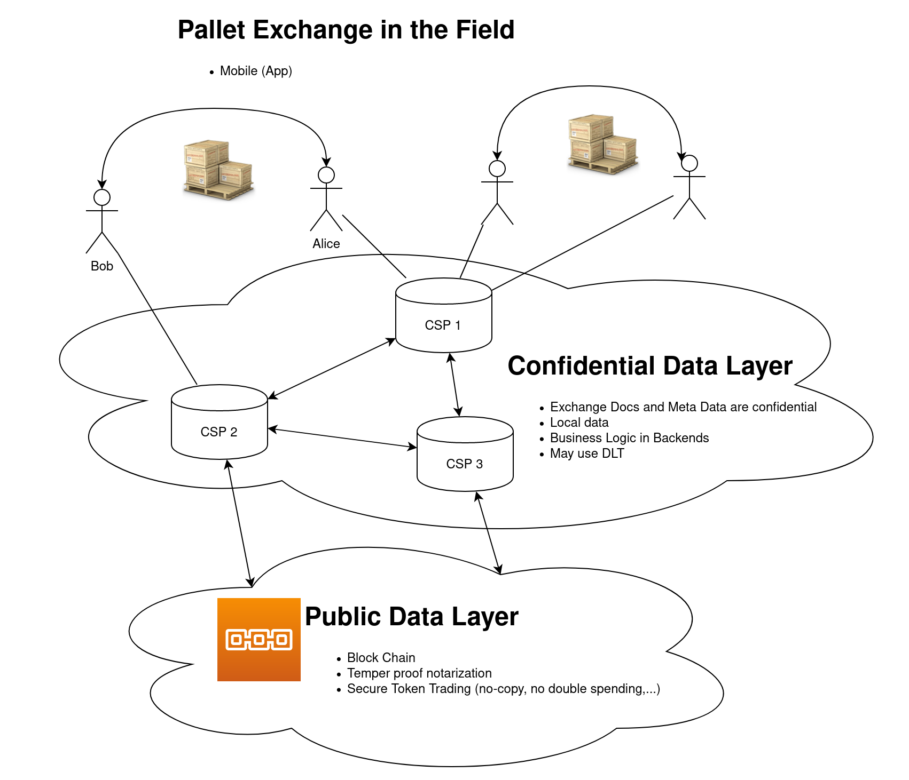
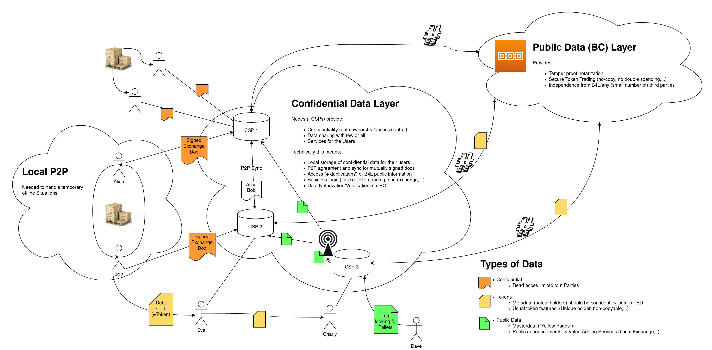
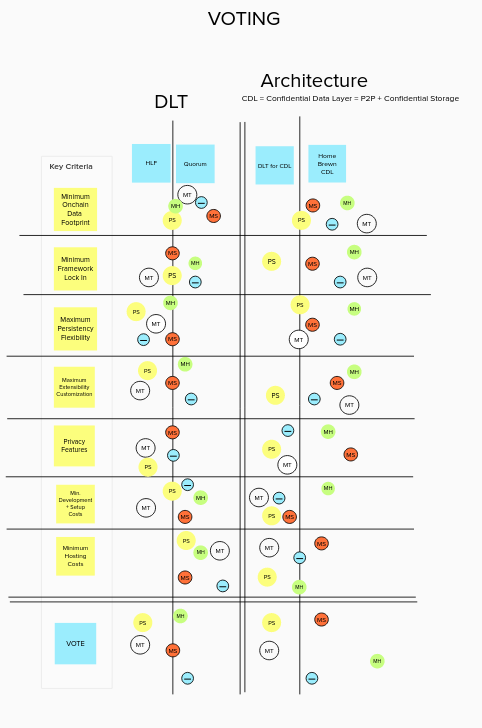

Block4Log: Architecture / DLT
===================
This is summary was written by Sebastian Schmittner <sebastian.schmittner@eecc.de>

High Level Architecture
----------

After thorough discussions and deep dive sessions, the architecture selection sub-team has developed and agreed upon many essential points. A bird view of the architecture was presented to the steering committee:

Some more details are given in the following sketch that also includes the various data types to be considered:

We have developed multiple architecture/Tech combinations which we consider feasible and which all have particular advantages and disadvantages. Important points to be answered differently by our models are:

Open Questions
--------------

1. Will the Confidential Data Layer (CDL) be build
  - using a DLT framework such as Hyper Ledger Fabric, Quorum, etc. i.e. based on Smart Contracts (Chain Code)
  - or by just defining the protocol?
2. Which DLT are we going to use?

These two questions are quite strongly interlinked, hence we joined the two
subgroups. A framework which provides lots of features for the CDL, such as
Hyper Ledger Fabric (HLF), typically comes with quite some complexity and hence
costs (effort) in setting it up. Using only the world state of HLF would not be
efficient. On the other hand, a more light weight framework such as Quorum,
means that many aspects of a DLT based confidential layer need to be implemented
in smart contracts so that a lower setup effort is set off by higher
implementation effort.

Models
---------

We have discussed the following three models, all of which can solve our problem
and yield a good architecture. We hereby give a concise summary of the main
advantages and disadvantages to enable an informed decision in the larger group.
The models are listed in increasing order of DLT usage.

We include a recommendation of the architecture/DLT selection subgroup for each of them.

### 1. Public Chain Based

In this architecture, the CDL is specified exclusively as a protocol. The consortium
provides a reference implementation which can be forked and adapted, but CSPs
can develop and run their own proprietary code independently of the consortium.

The Public Data (Block Chain) Layer is the public Ethereum main net to which we deploy a minimal set (likely 2) of smart contracts which enable B4L to notarize data (in particular LC exchange documents) and trade tokens using the ERC20 standard.

#### Main Advantage

Big public block chain networks provide the strongest form of temper proof
notarization and independence from any individual as well as the whole B4L
consortium. Even if the B4L consortium vanishes, documents can still be verified
and tokens (i.e. debt notes) still exist and can be traded independent from us.
This model uses a block chain in the strongest sense, i.e. according to the
strictest interpretation of the word. This is the only model for which the
public layer is failsafe/temper proof even if the majority or all of the
consortium fails or decides to cheat with debt notes.

#### Main Disadvantage

Transaction costs on Ethereum main net are about 50 cent to 1 dollar per transaction. Notarization can be efficiently compressed into few transactions per day, but really using ERC20 token on chain trading seems to be prohibitively costly.

#### Recommendation

If really strong block chain features are at the heart of the project, this
might be the only true path. However, the Architecture group does not believe
that the use case's needs justify the costs. We recommend using a private chain
for cost reasons, unless the consortium really wants to pay for a public block
chain solution.

**If the consortium decides that using the strongest block chain technology is worth the cost, this is the right model.**

### 2. Minimal Private Chain

In this model, we use a mostly protocol based CDL as in Model 1, but, instead of
connecting to a public chain, a private chain is used as the shared (i.e.
consortium-public but not world-public readable) ledger. Using a private chain
DLT framework such as Hyper Ledger Fabric means that the block generation is not
done through proof of * algorithms but through voting-type algorithms. Nodes
have to be admitted to the network and node identities are directly linked to
operating companies (CSPs). Fraud in this kind of network can be prevented by
monitoring and holding CSPs responsible by juristic means, hence byzantine fault
tolerance is less important.

#### Main Advantage

A model that uses a protocol based CDL provides the greatest flexibility for
CSPs to connect existing databases directly into the solution and to
build/extend on existing own/open source software. Adapting the protocol in the future is easy and components can be relatively easy to exchange, hence avoiding a lock in effect. 

Software development in this model will be more de-centralized.

#### Main Disadvantage

Developing a sound protocol specification is highly non-trivial. There is a much
higher risk of serious (security/privacy violating) bugs than for the DLT based
CDL. To get the protocol specification right and to implement the reference
implementation will be more effort (higher cost) and also maintaining the
solution might be more costly than for the DLT based CDL.

The consortium can not control the actual implementation of the protocoll, hence
a test bed leading to a "B4L compatible" certification is needed before a
proprietary implementation can be added to the network. Also stronger monitoring for correct behavior in production is needed.

Software development in this model will be more incoherent.

#### Recommendation

In this mode, a DLT with a low complexity, i.e. low cost/effort to setup and maintain should be used. We recommend using a minimal quorum layer as the consortium-public data layer which also makes possible future migrations/connections to another ethereum based block chain solution easier.

We consider this model to be the most attractive one for CSPs to join the consortium and develop their own solution/additional services.

**If attracting CSPs is the highest priority than this is the model to go for.**

### 3. Maximal DLT

Using as many of the features of a DLT framework as possible means using existing solutions instead of re-inventing the wheel. Putting the confidential communication and data storage inside a DLT framework (using side DBs) yields a tight coupling between the public layer given by the DLTs world state and the confidential layer.

#### Main Advantage

Many features which need to be specified in a protocol based CDL can readily be
used from a DLT framework such as Hyper Ledger Fabric. This saves development
and implementation effort and reduces the risk of critical bugs. Hence most of
the sub team members consider this solution to come with lower costs, at least
during development and setup.

Putting the CDL logic into Chain Code means that the consortium as a whole has
quite strong control over the exact code that is executed to fullfil the
protocol specifications, hence the risk of CSPs cheating or just having bugs in
their proprietary implementations is much lower leading to less
monitoring/testing of their code being necessary.
Software development will be more coherent.

#### Main Disadvantage

It is not possible to directly integrate existing databases, hence a lot of data duplication will occur at the CSPs when integrating customer data or maintaining more efficient views of the B4L data for analytics/added value services.
CSPs that want to add to the solution or customize need to learn how to connect to/use the DLT framework.

Software development will be more centralized.

#### Recommendation

When going for this architecture model, we recommend to use Hyper Ledger Fabric as the DLT since it brings most features so that the additional setup complexity is counter balanced by the features that we get.

This model would be a perfect DLT technology prototype project in order to learn and access a DLT framework in depth. 

**If the consortium decides to favour control over the software stack over freedom of the CSPs to implement their own code, this is the right model. Additionally this is the model which most of the subgroup believes to be most cost efficient.**

Voting
------

This section contains a detailled summary of the oppinions of the subgroup as collected in the 2020-08-05 meeting.

Out of 5 group members:

- 2:2 (1 undecided) voted for Hyper Ledger Fabric/Quorum, independently of the architecture. The conclusion is: the choice of DLT needs to depend on the architecture, we can not settle the discussion the other way around.

- 3:2 voted for the protocol based CDL (Model 1 or 2), but the choice really depends on the consortiums overall priorities as explained above.

For the individual Key Criteria:

- The total on-chain data footprint will eventually be a cost factor, since this is data volume which every CSP has to replicate and store. 
  - 3/5 think that Quorum will have a lower on-chain data footprint (2 undecided) 
  - 4/5 see this for the protocol based CDL (1 undecided). 

- Framework lock in for any solution will likely be strong enough that changing the DLT in the near future seems quite unlikely to be feasible.
  - 2:1 (2 undecided) think that Quorum has a less pronounced lock in than Hyper Ledger Fabric
  - 4:1 think that a protocol based CDL comes with less lock in than a DLT based one

- Persistency, i.e. which database technology to use, will be slightly more flexible for HLF than for quorum and way more flexible in a protocol based architecture than in a DLT based one.

- The group could not reach agreement whether Quorum or Hyper Ledger Fabric would be easier to adapt/customize for CSPs, but clearly a protocol based solution is easier to change than a DLT based one.

- HLF brings more features than quorum and 3:2 group members think that we can have better/more privacy/confidentiality related features in a DLT based solution than in a protocol based one.

- The development/setup (i.e. initial) costs will likely be lower for Quorum than for HLF and also lower in a DLT based setup than in a protocol based one, although the vote is not unanimous.

- Hosting cost are clearly lower for Quorum than for HLF (the only 0:5 vote) and there is a slight tendency  in the group to believe that the reburying costs will be lower for a DLT based CDL than for a protocol based one.