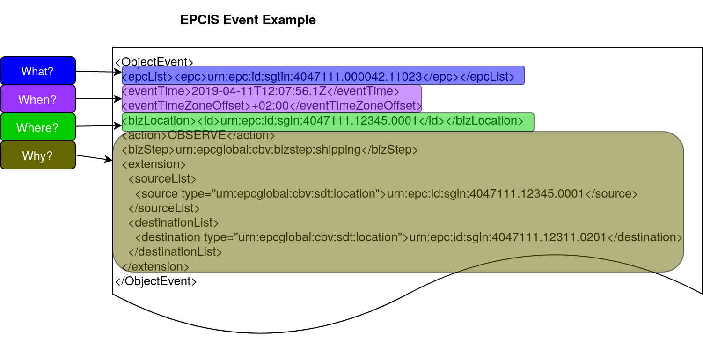

= Block4Log - Data Visibility
Sebastian Schmittner <sebastian.schmittner@eecc.de>
:toc:
:icons: font
ifdef::env-github[]
:imagesdir: pics/
:tip-caption: 💡
:note-caption: ℹ️
:important-caption: ❗
:caution-caption: 🔥
:warning-caption: ⚠️
endif::[]

== Data in Block4Log

The following types of data are going to be handled within Block4Log:

* Pallet exchange vouchers
- Data format: EPCIS
- Shipping/Receiving
- Number of Pallets
- When
- Where
- Double signed => 2 Signing parties

* Debt Notes
- Debtor
- Amount/Type/Quality of Pallets
- Holder ( = owner) of debt note
- History of double signed transactions => All former holders
*** Including transaction dates
*** Including Creation
*** Including voucher resolution (EOL) if applicable

* Company IDs
- GLN (GS1 Company Prefix)
- Master Data
*** At least Company Name
*** Details TBD

* Black Board/Pin Board for public Announcements
- Need Pallets
*** Location
*** Amount / type/ quality
*** Until
*** Kontakt/Service Endpoint to accept offer/start price negotiation
*** Pricing information
- Offer Pallets
*** As above
- More public announcements?

== Data Visibility Constraints

* All voucher data might be business relevant (revealing trade relations/volumes) 
** Full read access control by signing parties required

* Debt Notes
** Visibility constraints to be discussed
** Initial Holder/Holder history might be sensitive?

* Company IDS
** Public anyway
** Master data might be discussed

* Public Announcements
** Well... public ;)

== Block Chain Notarization with fine grained access control

The following technical concept, as developed independently by SAP/EECC/others,
can be applied to notarize data without giving up full fine grained access
control, hence data ownership. In this sense, the proof of data integrity is
"zero-knowledge", i.e. integrity of the data is secured without revealing any of
the data itself.

[[EPCIS_Example]]
.EPCIS Event Example

[[EPCIS_Hash]]
.(Flat) Hash Tree
image::pix/EPCIS-hash-tree.png[EPCIS Event Example]

[[EPCIS_Sharing]]
.Selectively revealing only some fields and intermediate hashes(yellow) is a zero-knowledge proof of the data integrity of the revealed values
image::pix/EPCIS-hash-tree-sharing.png[EPCIS Event Example]

