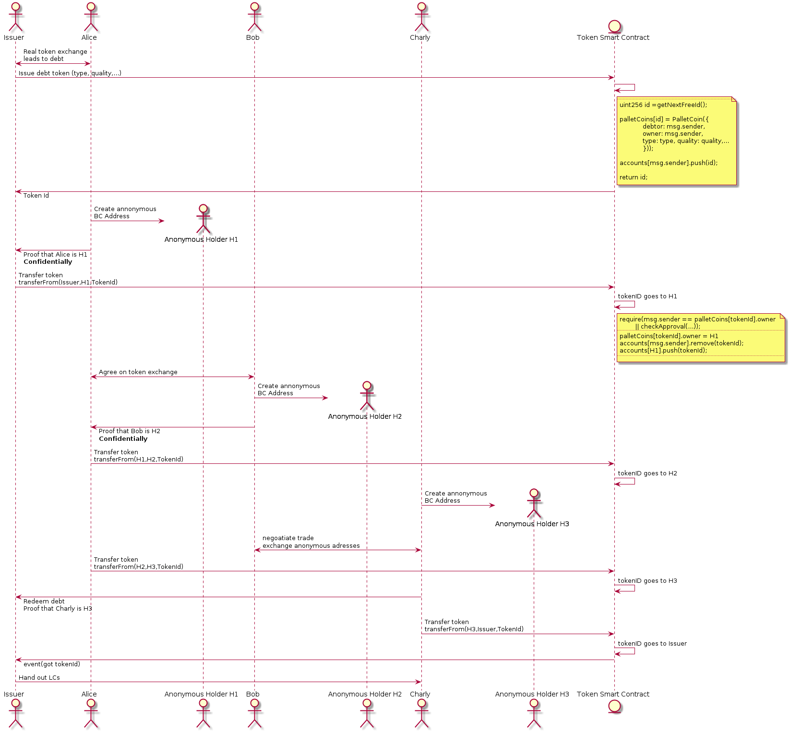

Confidential Token Trading
==========================

The following sequence diagram shows a possibility to implement an anonymous token exchange. Everything outside the yellow notes is general and can be implemented with pretty much any token.

The implementation hints in the yellow notes assume a ERC721 token contract with something like

```
struct PalletCoin{
        address debtor;
        address owner;
        string type; // LC type
        string quality;
        ...
    }

mapping(uint256 => PalletCoin) public palletCoins;

mapping(address => StructuredLinkedList.List) public accounts; // inverse of  i -> palletCoins[i].owner
```
Details (types, allowed values, etc.) are to be discussed, of course.




In the above sequence, a token with an individual id and certain properties (LC type, quality,...) is created and traded. At any point in time, there is a unique owner. Trading of the token according to the rules is ensured by the smart contract, in particular there is no double spending, etc.
All calls to the smart contract are on-chain transactions, i.e. visible to all network participants. Those calls reveal the Issuer's Adress which is public on purpose. After issuing, only the anonymous addresses created for the specific purpose of trading the token are revealed, not the addresses which are publicly known to belong to a certain company.
The anonymous addresses should be used only once and deleted as soon as they do not hold any tokens anymore.

This ensures that each token trader only knows the identities of the companies he has been directly trading with. Those direct trade partners reveal their own anonymous address to each other **off chain**, i.e. in a confidential p2p message exchange.
