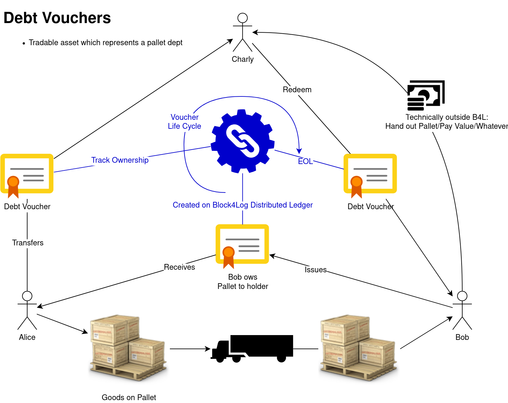

Tokens in Block4Log
===================
Sebastian Schmittner <sebastian.schmittner@eecc.de>

## Token

By Token we refer to a digital representation of an asset wich is tracked using
distributed ledger technology (DLT).

## Digital Twin Load Carrier Token

Since load carriers (LC) are the primary assets in the Block4Log use case, it is
not far fetched to think about digitizing the LC flow using tokens. However, it
was decided that accounting of LCs is not in scope of the Block4Log platform.

## Debt vouchers

This kind of tokens are a digital representation of a debt voucher stating that
the owner of the voucher (i.e. the holder of the token) has the right to claim a
certain amount of LCs of a certain type and quality from the debitor. LC type,
quality, amount and the debitor are "written on the debt note", i.e. attributes
of the digital token. Additionally, there is a "best before" date on which the
debt note expires if it is not claimed in due course.

Debt vouchers are brought into circulation by the debitor and can thereafter be
freely traded among Block4Log customers. Eventually, the voucher is returned to
the debitor by the latest owner redeeming the stated amount of LCs.

### Individual Debt Token

The simplest version of the debt voucher is, just as described above, a digital
representation of a debt of one of the Block4Log customers towards the holder of
the debt voucher.

This kind of vouchers suffers from the risk of the debitor vanishing, e.g.
through going bankrupt. In this case, Insolvency is handled but eventually the
debt voucher might become worth less.

Technically handling these kind of vouchers is rather simple. Any Block4Log
Customer can issue vouchers on his own name and distribute them.

### Consortium Backed Debt Token

To enhance the trust in the value of the debt vouchers, the consortium might
back the debt vouchers. This might happen via insurance, escrow, or similar
means.

These kind of debt tokens are technically and legally more involved, but they
obviously provide a higher level of trust/security for the holder.

Issuing of tokens in this case needs to involve the consortium itself. In a
straight forward implementation, only the consortium is allowed to issue tokens.
At this moment they need to make sure that they can backup the risk associated
with the above mentioned bankruptcy of the debitor. The token is then **sold**
to the debitor, charging him for the insurance of the risk.
